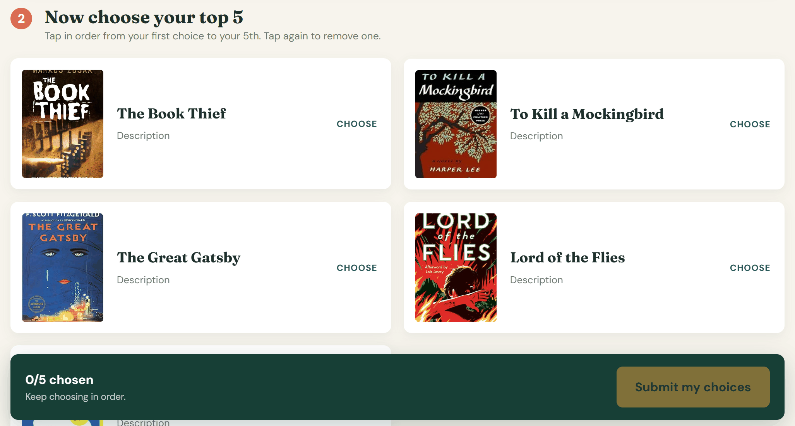
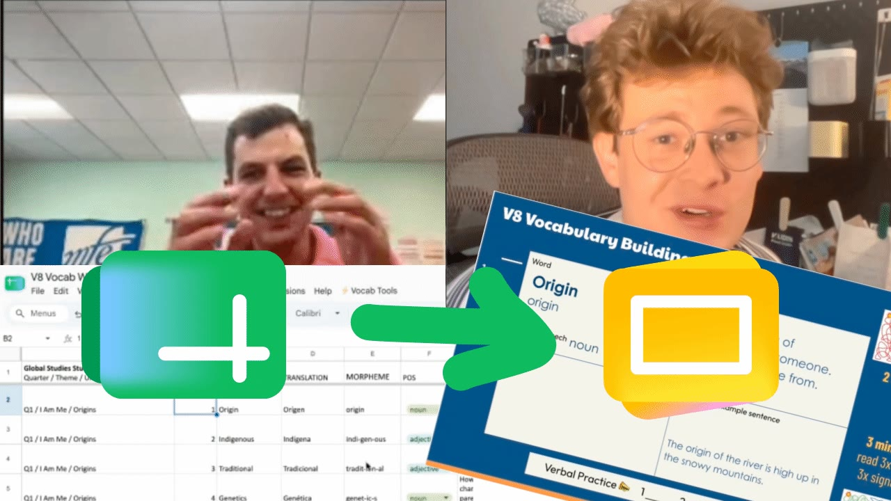
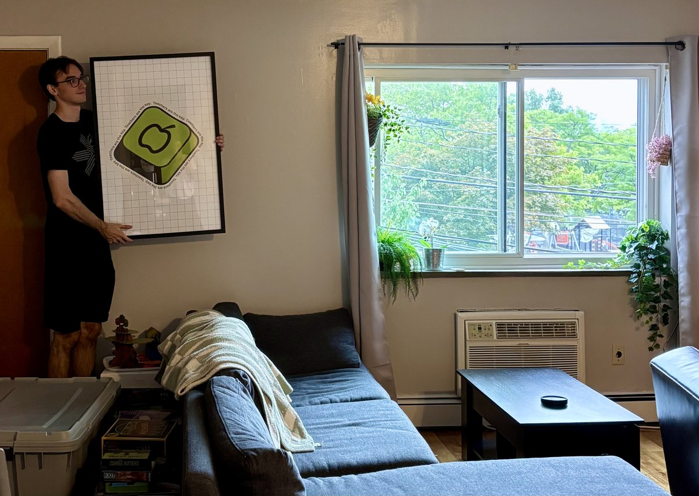

Hi there,

This is Elliot from the EdTech-a-thon team. I hope your week is going well! This is the first EdTech-a-thon weekly update we're sending as we continue to build & release solutions to teacher-submitted problems. We'll also include fun updates about the team and highlight some awesome educators.

If at any point you want to stop receiving these emails, just tell us and we'll take you off the list.

Without further ado, here goes the first update!

**Making book club groups easy with GroupReaders.com**

This week, we wrapped up a website for Carrie, a 9th Grade English teacher from Utah. She spends hours organizing their students into book club groups and has several classes of roughly 40 students (!!!) who have to be divided into ten groups. Carrie gives her students a form to record their preferences for which books they’d like to read, and previously she had to manually group her students.

At the 2026 EdTech-a-thon, developer Duncan Johnson worked with Carrie to create GroupReaders. Teachers create a list of books, send out a form link to their students, and configure how they want groups to be organized. Then, voilà! GroupReaders creates mathematically perfect groups instantly.

If you want to help us bring [GroupReaders.com](http://groupreaders.com) to more teachers, please forward this email to an English teacher you know who organizes book club groups with their students!

---

**Teacher Solution Spotlight: Sam's trick to generate vocab slides from spreadsheets**

If you're heading back to school and find yourself making similar slides over & over by hand, awesome teacher (and in-person EdTech-a-thon 2026 attendee!) Sam Quincy built a solution. We met with him this week to discuss the tool he made that lets him turn his class vocab spreadsheet into slides in about 10 seconds.

If you have 5 minutes and want to automate repetitive slide creation for yourself, here's a tutorial with Sam! He uses his vocab spreadsheet as an example, but you can use this to generate slides for just about anything (homeroom slides, a daily challenge, etc).

[Click here to learn how to set it up yourself](https://youtu.be/bGqjJQZHwjM)

---

**Updates from the EdTech-a-thon Team: I moved across the country so we can keep solving your problems**

Mere weeks after the EdTech-a-thon, I packed up everything I own in Atlanta and moved into an apartment with Duncan (another EdTech-a-thon director) in Boston. We've been having a blast developing solutions for teachers as well as decking out our apartment with posters from the EdTech-a-thon.

We've been blown away by the amazing folks in the EdTech-a-thon community who are supporting us on the journey. Kara, one of the wonderful EdTech-a-thon developers, got us electric salt & pepper mills as a housewarming gift, which we have been putting to good use.

From the entire team, we wish you all the best of luck as you get back into the swing of things. Truly, YOU ARE THE BEST! We've been blown away by the curiosity, generosity and kindness of everyone we've worked with.

Until next week,  
Elliot & the EdTech-a-thon team
