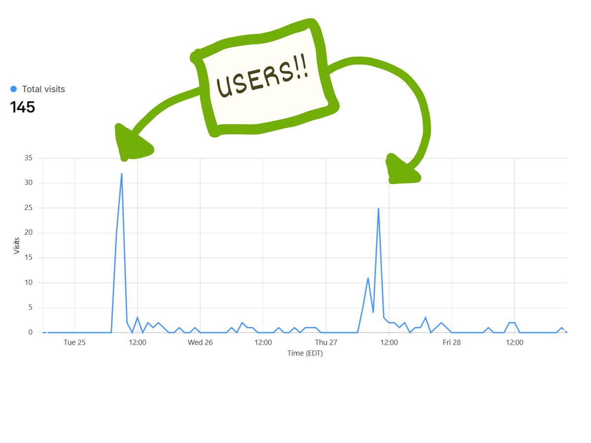
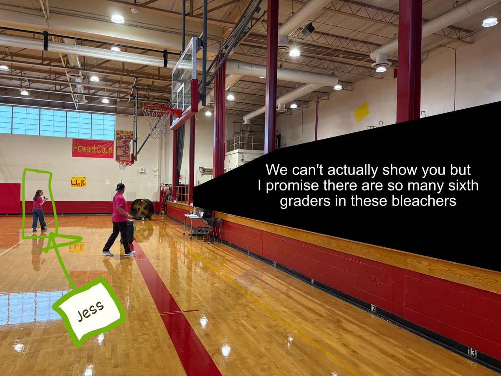

Hi there,

This is Duncan from the EdTech-a-thon team. Welcome to our second weekly newsletter!

**Our first classroom usage!**

Two websites we built this summer were used in a classroom last week! [Clef Coach](https://clefcoach.com) helps orchestra students practice which string and finger is required to play a note. [Forensic Simulator](https://forensicsimulator.com) helps forensic science students practice handling evidence from a simulated cartoon crime scene. We collect minimal user data, so this is pretty much all we can see, but I think this means a classroom of students used our tools!

Thank you to all the teachers and developers for your hard work building software during the EdTech-a-thon – your work is starting to make an impact in schools! A special shout out to teachers Chris and Hanna who were the driving forces behind Clef Coach and Forensic Simulator, respectively.

---

**Do you make different versions of tests? Elliot needs your help!**

Elliot is working with rockstar science teacher Valerie to build a tool to make different versions of tests from question banks. If you give multiple versions of tests in your class, Elliot has a couple of questions for you…

- How do your tests change between versions?
- Where do you make your tests (Google Docs, Word, ExamView, etc…)?
- What's the hardest part of making different test versions?

If you're reading this Monday morning, Elliot is almost assuredly drinking coffee and building this right now. Please reply if you have any answers, thoughts, or requests for question bank and test editing tools. Trust me, Elliot will read every single reply.

---

**Jess' Super Bowl and her first week back to school**

EdTech-a-thon 2026 director Jess Golab (middle school math teacher, generally awesome) had her first week of school last week. She organizes her school's WEB (Where Everyone Belongs) program, which introduces 6th graders to middle school by giving them an 8th grade mentor who can show them the ropes in a friendly and exciting way. Jess told me this weekend that WEB is like her Super Bowl.

I'm amazed by the impact that Jess is having by supporting 6th graders at her school. I wish Jess was my teacher in middle school!

---

**We're re-branding (sort of)**

As we look towards next summer's EdTech-a-thon, we've decided to re-name the overarching non-profit organization to "teacher.dev." Same team, same mission. teacher.dev will organize the annual EdTech-a-thon, provide software maintenance, and more. The newsletter next Monday will come from elliot@teacher.dev; check your spam folder if you don't see it.

Have a great week, you're awesome.

Duncan and the ~~EdTech-a-thon~~ teacher.dev team
