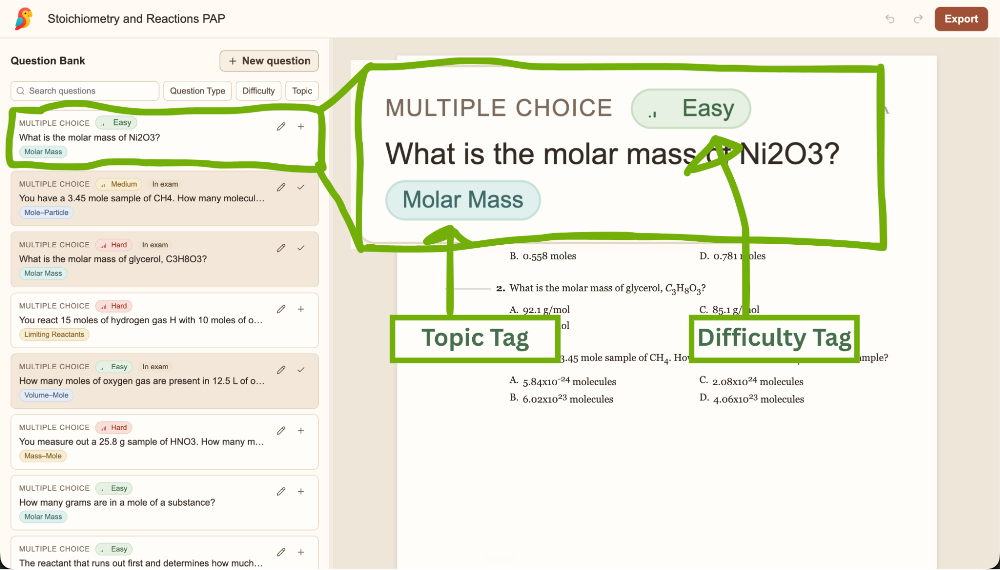

Hi there,

This is Elliot from the ~~EdTech-a-thon~~ teacher.dev team. Happy Labor Day to our American and Canadian readers, and welcome to our *third* weekly newsletter (woot woot)!

---

**Do you have a back-to-school problem? Send it our way!**

Our mission at teacher.dev is to solve as many teacher problems as possible, and we want to set a high bar. Here's our goal: solve one teacher's problem every single day. Some days will be a brand new website we've built for a teacher, and others will be about an improvement we've made to an existing app.

So, if you have a problem as you're heading back to school, **please reply to this email with your problem** (we read every single reply) and we'll add it to our list for the coming week.

---

**Test builder development update ([TestParrot.com](http://testparrot.com/))!**

Last week, I got wonderfully thoughtful and detailed responses from Katherine, Kirsten, Devon, Teneya, Colleen, and Apoorva about how they create tests (thank you all so so much!!).

A lot of folks stressed the importance of ensuring that different versions of tests cover the same topics with a similar level of difficulty. So I built a website with a question bank where you can tag & sort questions by topic and difficulty level. To build your test, you then drag and drop questions from the bank to the page!

If you're interested in poking around, check it out at [TestParrot.com](http://testparrot.com/). Right now, it only supports multiple choice and short answer questions, but if you have suggestions for other question types, please let me know! Just reply to this email and I'll add it (again, we read literally every email we get).

---

**Josh's back to school cooking contest**

The one and only Josh Pullen (teacher.dev director and high school math teacher), is heading back to school this week. This past week was prep week at his school and they hosted a back-to-school breakfast cooking competition between all the teachers.

Josh and his team made cinnamon bites and while they haven't released the results yet, Josh says he's feeling pretty good about their chances. We'll let you know if he wins!

---

That's it for this week folks. If you have the day off today for Labor Day, we hope it's relaxing! Y'all are the best,

Elliot and the ~~EdTech-a-thon~~ teacher.dev team
