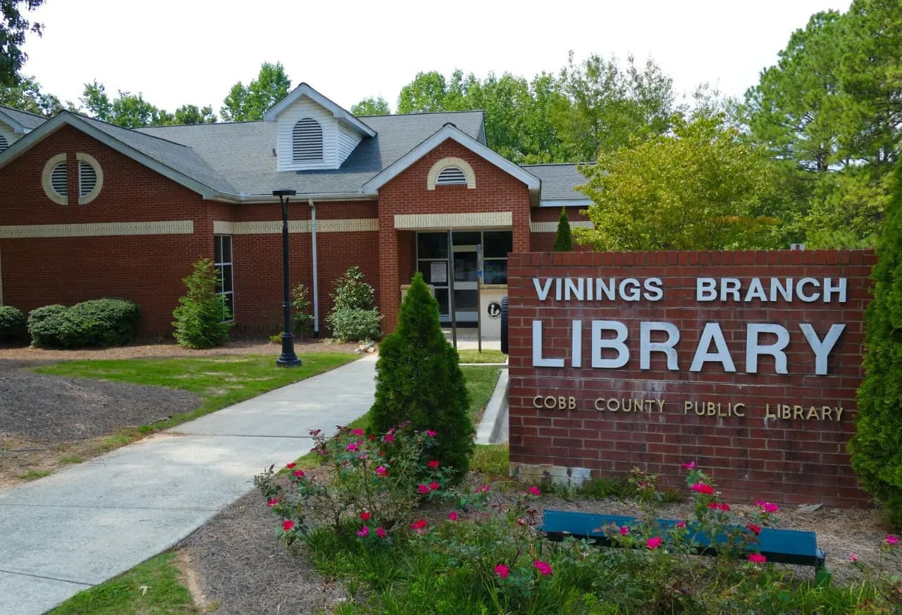

Hi there,

It's Duncan from the teacher.dev team. We hope your start of the year is going well.

First off, we originally planned for this to be a weekly newsletter, but we're going to switch to monthly so each update is as valuable to you as possible (we want to make sure we don't waste your time!). If you want to keep up-to-date with our day-to-day, follow our [Instagram](https://www.instagram.com/teacherdotdev/).

---

**We're releasing more solutions than ever**

Last week, we told you about our goal of solving one teacher's problem every single day. We're currently on Day 13 and still going strong! You can see the problems we've solved by visiting [teacher.dev/daily](https://teacher.dev/daily)!

My favorite part of this process has been the speed we can hear feedback from teachers. This past weekend, we received suggestions from half a dozen teachers about [BridgeToAAC.com](https://bridgetoaac.com), an EdTech-a-thon tool that Josh, Megan, and I built. We were able to incorporate the feedback and release an update yesterday evening so that the apps we create match what teachers want!

---

**Are you an SLP interested in creating AAC boards? I need your help!**

One of our big undertakings during the 2026 EdTech-a-thon was to create a free AAC app, to make communication for nonverbal students more accessible. We've been having biweekly meetings with several amazing folks (special shout-out to Kéa and Peyton for being there in every meeting, giving fantastic ideas and feedback), and have a live preview at [voicecommons.com](http://voicecommons.com).

But we need help! We are not SLPs and have never taught students who use AAC boards, but we know VoiceCommons needs to have default boards that new users can add to get set up quickly. If you have experience with AAC apps and want to create or give feedback on the default board layout, please reply to this email! We read every reply to these emails.

---

**Community Spotlight: Kara's workshop for job seekers**

Kara Auger, teacher.dev team member and EdTech-a-thon 2026 developer, recently taught a free workshop at her local library to help job seekers use AI to save time during the application process. One participant said "Kara Auger is thought provoking and ensures that the activities are interactive."

Kara is the absolute best. We're proud to see her sharing her skills with other folks and making an impact!

---

Have a great month, you're the best.

Duncan and the teacher.dev team
